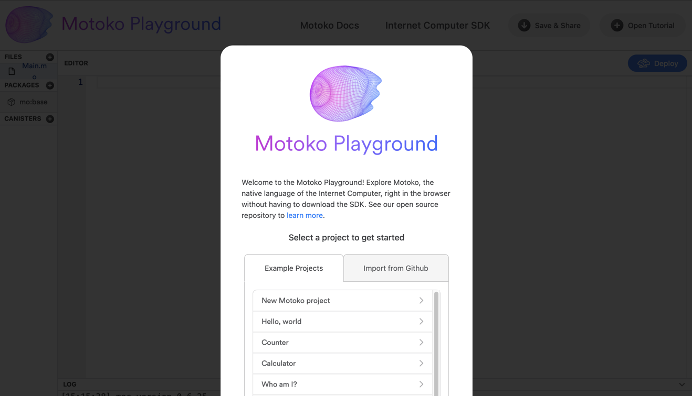
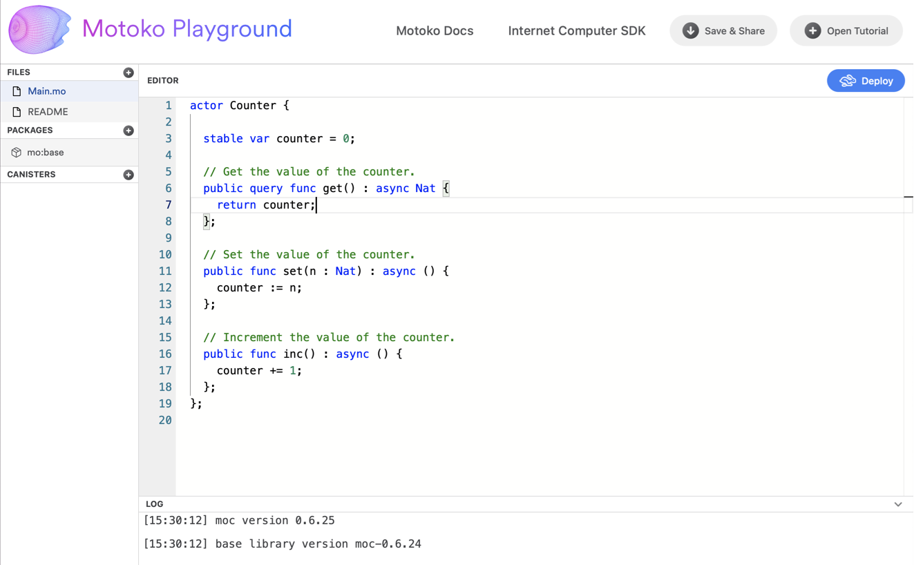

# Getting to know the motoko playground

---

<!-- ## Install - Create - Run -->

Motoko playground is a simple web interface that allows you to write and deploy motoko code in your web browser. It is a #1 choice for developers that just have started getting to know about the Internet Computer ecosystem and want to learn motoko programing language.

> Motoko is a programing language developed natively for the Internet Computer blockchain. If you want to learn more about Motoko, visit the [documentation page](https://smartcontracts.org/docs/language-guide/motoko.html).

## Start first project

You can easily open Motoko playground by visiting this link https://m7sm4-2iaaa-aaaab-qabra-cai.raw.ic0.app/

You should se a modal window simmilar to the screen above that is basically giving you three options:

1. Create a new blank project
2. Open one of the pre-prepared projects 
3. Import code from public Github repo

If you want to start coding from scratch, clicking on New Motoko project is the best option for you. In this tutorial, let's click on the **Counter** example so we can demonstrate how to use the playground. 

This will get you the a Readme file that describes the project and presents how to deploy the code locally on your computer. As Motoko playground is working in the browser, **you don't need to set up your local development enviroment and install the SKD now**. Skip this and just click to the Main.mo file on the left hand side. This will bring you to the code.

This is how your workspace looks. On the left, you can manage files in your project, load packages and other canisters (smart contracts). In the bottom is a little console that shows you logs, this is where you look for error messagess when deploying. In the top right there is a Deploy button that we will use for deploying and testing our code.

## Deploying the project

Counter example is a very simple project to start with. Explaining the code in detail is above the scope of this tutorial but we will briefly go through it just to see what we can expect.

The actor has a stable variable counter, that will store the number of the counter and 3 public funcitons – get, set and inc. These functions form a public interface of our canister and we will see them in the generated Candid interface after deploy.

> Candid is an IDL (interface definition language) developed for the IC ecosystem in order to facilitate communication between services written in different programing languages. You can read more about it [here](https://medium.com/dfinity/candid-a-tool-for-interoperable-programming-languages-on-the-internet-computer-27e7085cd97f).

Motoko playground not only allows you to write and deploy your code, it also generates a Candid UI so you can test the functionality. **Click on the deploy button to see it in action**.

First, you need to confirm the deploy by selecting a canister name and set up a garbage collector strategy. You can keep the settings as it is for now and click Install. You should see a success message in the console log and a candid UI generated in the right.

